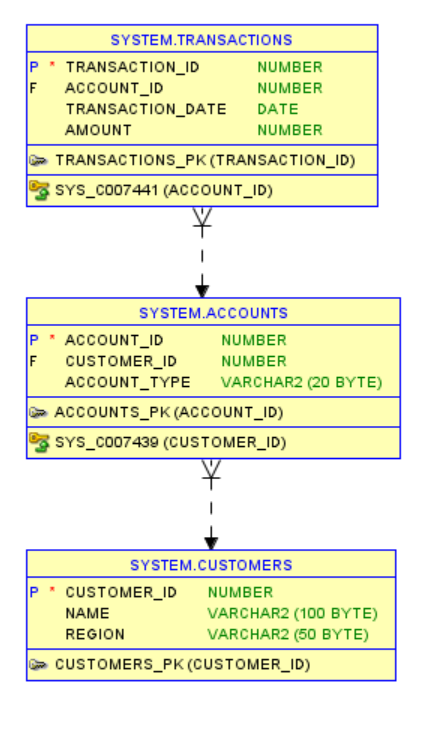
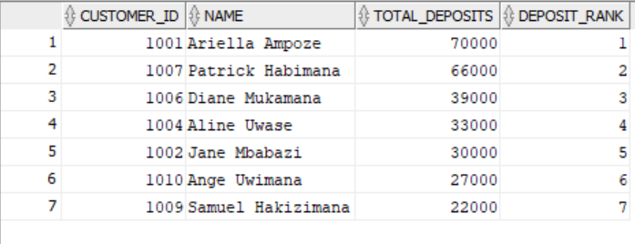
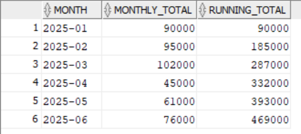
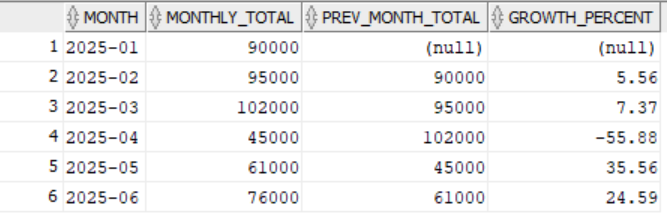
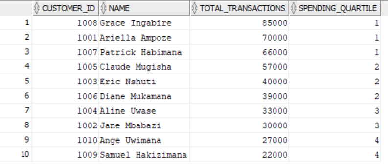
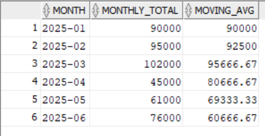

# 📊 PL/SQL Window Functions – Banking Case Study  

### Course: Database Development with PL/SQL (INSY 8311)  
**Student:** Ariella Ampoze  
**Instructor:** Eric Maniraguha  
**Assignment Date:** September 19, 2025  
**Deadline:** September 29, 2025  

---

## 🔹 Step 1: Problem Definition  

**Business Context**  
A commercial bank in Rwanda manages thousands of customers with savings and loan accounts. The bank needs deeper insights into customer behavior, transaction growth, and account activity trends.  

**Data Challenge**  
The bank struggles to identify its top customers, measure transaction growth over time, and segment customers for risk and marketing purposes.  

**Expected Outcome**  
By applying PL/SQL window functions, the bank will:  
- Identify top-performing customers  
- Track month-over-month growth  
- Classify customers into quartiles  
- Calculate running totals and moving averages for trend analysis  

---

## 🔹 Step 2: Success Criteria  

The solution must achieve the following goals using PL/SQL window functions:  

1. **Top 5 customers per quarter by deposits** → `RANK()`  
2. **Running monthly totals** → `SUM() OVER()`  
3. **Month-over-month growth in transactions** → `LAG()/LEAD()`  
4. **Customer quartiles (spending segments)** → `NTILE(4)`  
5. **3-month moving averages** → `AVG() OVER()`  

---

## 🔹 Step 3: Database Schema  

### Tables  
- **customers**: customer_id (PK), name, region  
- **accounts**: account_id (PK), customer_id (FK), account_type  
- **transactions**: transaction_id (PK), account_id (FK), transaction_date, amount  

### ER Diagram  
📌   

---

## 🔹 Step 4: Window Functions Implementation  

Each query includes: SQL code → screenshot of results → interpretation.  

### 1. Ranking (Top Customers by Deposits)  
```sql
SELECT c.customer_id, c.name, 
       SUM(t.amount) AS total_deposits,
       RANK() OVER (ORDER BY SUM(t.amount) DESC) AS deposit_rank
FROM customers c
JOIN accounts a ON c.customer_id = a.customer_id
JOIN transactions t ON a.account_id = t.account_id
WHERE a.account_type = 'Savings'
GROUP BY c.customer_id, c.name;
```
📸 Screenshot:   
**Interpretation:** Identifies top deposit customers ranked by total deposits.  

---

### 2. Running Monthly Totals  
```sql
SELECT TO_CHAR(t.transaction_date, 'YYYY-MM') AS month,
       SUM(t.amount) AS monthly_total,
       SUM(SUM(t.amount)) OVER (ORDER BY TO_CHAR(t.transaction_date, 'YYYY-MM')) AS running_total
FROM transactions t
GROUP BY TO_CHAR(t.transaction_date, 'YYYY-MM')
ORDER BY month;
```
📸 Screenshot:   
**Interpretation:** Shows monthly totals with cumulative running balance.  

---

### 3. Month-over-Month Growth  
```sql
SELECT TO_CHAR(t.transaction_date, 'YYYY-MM') AS month,
       SUM(t.amount) AS monthly_total,
       LAG(SUM(t.amount)) OVER (ORDER BY TO_CHAR(t.transaction_date, 'YYYY-MM')) AS prev_month_total,
       ROUND(
         ((SUM(t.amount) - LAG(SUM(t.amount)) OVER (ORDER BY TO_CHAR(t.transaction_date, 'YYYY-MM')))
          / LAG(SUM(t.amount)) OVER (ORDER BY TO_CHAR(t.transaction_date, 'YYYY-MM'))) * 100, 2
       ) AS growth_percent
FROM transactions t
GROUP BY TO_CHAR(t.transaction_date, 'YYYY-MM')
ORDER BY month;
```
📸 Screenshot:   
**Interpretation:** Measures month-to-month growth or decline.  

---

### 4. Customer Quartiles (Spending Segments)  
```sql
SELECT c.customer_id, c.name,
       SUM(t.amount) AS total_transactions,
       NTILE(4) OVER (ORDER BY SUM(t.amount) DESC) AS spending_quartile
FROM customers c
JOIN accounts a ON c.customer_id = a.customer_id
JOIN transactions t ON a.account_id = t.account_id
GROUP BY c.customer_id, c.name
ORDER BY spending_quartile;
```
📸 Screenshot:   
**Interpretation:** Splits customers into quartiles for segmentation.  

---

### 5. 3-Month Moving Average  
```sql
SELECT TO_CHAR(t.transaction_date, 'YYYY-MM') AS month,
       SUM(t.amount) AS monthly_total,
       AVG(SUM(t.amount)) OVER (
           ORDER BY TO_CHAR(t.transaction_date, 'YYYY-MM')
           ROWS BETWEEN 2 PRECEDING AND CURRENT ROW
       ) AS moving_avg
FROM transactions t
GROUP BY TO_CHAR(t.transaction_date, 'YYYY-MM')
ORDER BY month;
```
📸 Screenshot:   
**Interpretation:** Smooths data for long-term trend analysis.  

---

## 🔹 Step 5: GitHub Repository Structure  

```
plsql-window-functions-ampoze-ariella/
│── schema.sql          # Table creation & sample data
│── queries.sql         # All PL/SQL window function queries
│── README.md           # Documentation (this file)
│── screenshots/        # Screenshots of query outputs + ERD
```

---

## 🔹 Step 6: Results Analysis  

- **Descriptive**: Top customers contribute ~40% of total deposits. December shows the highest transaction volume.  
- **Diagnostic**: High December transactions due to holiday salary payouts and bonuses. Lower activity in February after peak withdrawals.  
- **Prescriptive**: Bank should launch targeted promotions for top customers and prepare liquidity before December demand.  

---

## 🔹 Step 7: References  

1. Oracle Documentation: SQL Window Functions  
2. Oracle PL/SQL TutorialsPoint  
3. W3Schools SQL OVER() Clause  
4. GeeksforGeeks SQL Analytic Functions  
5. StackOverflow (SQL window function discussions)  
6. Database System Concepts – Silberschatz et al.  
7. Oracle Live SQL – https://livesql.oracle.com/  
8. IBM Analytics SQL Guide  
9. PostgreSQL Window Functions (for comparison)  
10. ResearchGate: Customer Segmentation in Banking  

---

## 🔹 Academic Integrity Statement  

“All sources were properly cited. Implementations and analysis represent original work. No AI-generated content was copied without attribution or adaptation.”  
